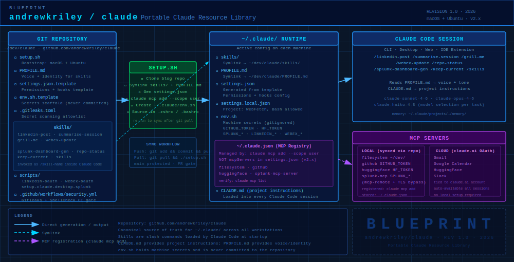

# claude

Portable Claude Code resource library — skills, profile, MCP config, and scripts — synced via Git and applied to any machine running Claude Code.

This repo is the canonical source of truth for `~/.claude/` across all workstations.



---

## Repository structure

```
claude/
├── setup.sh                        # Bootstrap script (macOS + Ubuntu)
├── PROFILE.md                      # Voice/identity profile for content skills
├── settings.json.template          # Template for ~/.claude/settings.json (permissions, hooks — NOT MCP servers)
├── env.sh.template                 # Secrets template (never commit populated version)
├── .gitleaks.toml                  # Gitleaks config — allowlists known false positives
├── .claude/
│   ├── settings.json               # Project-scoped settings
│   └── settings.local.json         # Project-scoped permissions (WebFetch, Bash)
├── scripts/
│   ├── linkedin-oauth.sh                  # One-time LinkedIn OAuth setup
│   ├── webex-oauth.sh                     # One-time Webex OAuth setup
│   └── setup-claude-desktop-splunk.sh     # Configure Splunk MCP server in Claude Desktop (macOS)
├── skills/
│   ├── new-post-andrewriley-info/  # Hugo blog post creation pipeline
│   ├── linkedin-post/              # LinkedIn draft + publish
│   ├── summarise-session/          # End-of-session summary
│   ├── grill-me/                   # Deep design interview skill
│   ├── webex-update/               # Send a session update to a Webex room
│   ├── skills/                     # List all available skills
│   ├── splunk-dashboard-gen/       # Splunk Dashboard Studio + AI background image + live deploy
│   ├── repo-status/                # Git repo sync status across local/remote branches
│   └── keep-current/               # Audit and sync README, CLAUDE.md, and PROFILE.md with repo state
└── .github/
    └── workflows/
        └── security.yml            # CI security scanning (Gitleaks + ShellCheck)
```

---

## Setting up a new machine

```bash
git clone https://github.com/andrewkriley/claude.git ~/dev/claude
cd ~/dev/claude
./setup.sh
```

`setup.sh` supports macOS and Ubuntu. It will:
- Clone the blog repo to `~/dev/www-andrewriley-info`
- Symlink `skills/` → `~/.claude/skills/`
- Symlink `PROFILE.md` → `~/.claude/PROFILE.md`
- Generate `~/.claude/settings.json` from `settings.json.template`
- **Register local MCP servers** (filesystem, github, splunk-mcp-server, huggingface) via `claude mcp add --scope user` into `~/.claude.json`
- Create `~/.claude/env.sh` from `env.sh.template` (secrets, never committed)
- Add `env.sh` sourcing to `.zshrc` / `.bashrc`

After setup, fill in `~/.claude/env.sh` with your tokens:

```bash
# Required
GITHUB_TOKEN=...        # Fine-grained PAT — see GitHub PAT section below

# For Webex session updates (run scripts/webex-oauth.sh to populate)
WEBEX_CLIENT_ID=...
WEBEX_CLIENT_SECRET=...
WEBEX_TOKEN=...
WEBEX_REFRESH_TOKEN=...

# For LinkedIn publishing
LINKEDIN_CLIENT_ID=...
LINKEDIN_CLIENT_SECRET=...
LINKEDIN_TOKEN=...      # Generated by scripts/linkedin-oauth.sh
LINKEDIN_PERSON_URN=... # Generated by scripts/linkedin-oauth.sh

# For Splunk MCP queries
SPLUNK_HOST=...         # Hostname/IP only, no port (e.g. 10.66.121.3)
SPLUNK_TOKEN=...        # Encrypted MCP token from Splunk MCP Server app (Settings > MCP Tokens)
                        # NOTE: this is NOT a regular Splunk API token — MCP use only

# For Splunk Dashboard Studio deployment (splunk-dashboard-gen skill)
SPLUNK_API_TOKEN=...    # Native Splunk API token from Splunk Web → Settings → Tokens
                        # OR use SPLUNK_USER / SPLUNK_PASS for basic auth instead

# For HuggingFace image generation (local MCP server)
HF_TOKEN=...            # From https://huggingface.co/settings/tokens
```

For LinkedIn and Webex credentials, run:
```bash
./scripts/linkedin-oauth.sh
./scripts/webex-oauth.sh
```

---

## Keeping machines in sync

```bash
# On the machine where you made changes:
git add -A && git commit -m "..." && git push

# On other machines:
git pull && ./setup.sh
```

---

## Path conventions

All skills use `$HOME`-relative paths. Every machine must follow this layout:

| Path | Contents |
|---|---|
| `~/dev/claude` | This repo |
| `~/dev/www-andrewriley-info` | Hugo blog repo |
| `~/dev/claude-created-dashboards/` | Splunk dashboards generated by skills (not in repo) |
| `~/.claude/skills/` | Symlink → `~/dev/claude/skills/` |
| `~/.claude/PROFILE.md` | Symlink → `~/dev/claude/PROFILE.md` |
| `~/.claude/env.sh` | Machine-specific secrets (gitignored) |
| `~/.claude/settings.json` | Claude Code settings: permissions, hooks (generated from template) |
| `~/.claude.json` | **Active MCP server registry** — managed by `claude mcp add`, never edit manually |

---

## Skills

Skills are invoked inside Claude Code with `/skill-name`. They are symlinked from `skills/` into `~/.claude/skills/` by `setup.sh`.

### Quick reference

| Skill | Invoke | Purpose |
|---|---|---|
| `new-post-andrewriley-info` | `/new-post-andrewriley-info [topic]` | Write and publish a Hugo blog post |
| `linkedin-post` | `/linkedin-post [topic]` | Draft and publish a LinkedIn post |
| `summarise-session` | `/summarise-session` | Summarise the current working session |
| `grill-me` | `/grill-me [topic]` | Deep design interview for plans and projects |
| `webex-update` | `/webex-update [topic]` | Send a session update to a Webex room |
| `skills` | `/skills [filter]` | List all available skills and configured MCP servers |
| `splunk-dashboard-gen` | `/splunk-dashboard-gen [title]` | Generate a Splunk Dashboard Studio dashboard with AI background image and deploy it live |
| `repo-status` | `/repo-status [path]` | Check branch sync status across local/remote for any git repo |
| `keep-current` | `/keep-current [focus]` | Audit README, CLAUDE.md, and PROFILE.md against actual repo state and propose updates |
| `security-audit` | `/security-audit [focus]` | Audit all Claude access — MCP servers, tokens, filesystem, permissions, skills — and produce a dated report |

---

### `/new-post-andrewriley-info [topic]`

Creates a new Hugo blog post for [andrewriley.info](https://andrewriley.info) from a recent coding session.

**What it does:**
1. Reads recent git history to understand what was worked on
2. Picks a slug and title based on the topic (or infers from commits)
3. Creates the post file at `~/dev/www-andrewriley-info/content/post/<year>/<slug>/index.md` with correct RFC3339 date (AEST/AEDT aware)
4. Commits to `dev` branch and pushes
5. Waits for CI/CD build, then validates the post at `https://dev.andrewriley.info/p/<slug>/`
6. Asks whether to merge to `main` and publish live

**Notes:**
- Reads `PROFILE.md` to match Andrew's writing voice and style
- Date uses `date '+%Y-%m-%dT%H:%M:%S%z'` via Bash tool — handles both AEST (+10:00) and AEDT (+11:00)
- Trigger phrases: "write a post about", "blog about what we did", "create a post from our session", "document this"

---

### `/linkedin-post [topic]`

Drafts and publishes a LinkedIn post as Andrew Riley.

**What it does:**
1. Checks LinkedIn credentials (`LINKEDIN_TOKEN`, `LINKEDIN_PERSON_URN`) from `~/.claude/env.sh`
2. Reads `PROFILE.md` for voice, tone, and focus areas
3. Drafts a post (150–300 words) with a strong hook, story, and takeaway
4. Shows the draft and offers one round of revisions
5. Optionally attaches an image — AI-generated via HuggingFace or a user-provided local file
6. Publishes via LinkedIn UGC Posts API on confirmation (3-step asset upload when an image is included)

**Notes:**
- Requires OAuth setup: `./scripts/linkedin-oauth.sh`
- If token is expired (401), re-run `linkedin-oauth.sh`
- No buzzwords, no bullet walls, short paragraphs, 2–4 hashtags at the end
- AI-generated images use the local `huggingface` MCP server (`HF_TOKEN` required)

---

### `/summarise-session [project]`

Produces a concise end-of-session summary covering what was worked on, what was achieved, what remains, and any blockers.

**What it does:**
- Reviews recent git history and conversation context
- Outputs a structured summary suitable for handoff or reference

---

### `/grill-me [topic]`

Runs a rigorous, structured design interview before touching any config or code.

**What it does:**
1. Maps the full design tree (architecture, workflow, tooling, deployment, dependencies)
2. Works through each branch one question at a time, resolving dependencies before moving on
3. Reads existing files (CLAUDE.md, env.sh, config) to avoid asking questions it can answer itself
4. Produces a **Shared Understanding** document: decisions made, open questions, proposed next steps

**Notes:**
- Use before any non-trivial infrastructure or config change
- Best for surfacing hidden assumptions early (e.g. "Claude Desktop doesn't source .zshrc")
- Trigger: "grill me on [topic]" or "let's think through [plan]"

---

### `/webex-update [topic]`

Posts a short session update to a Webex room.

**What it does:**
1. Searches for a Webex room by name (uses `WEBEX_TOKEN` from `~/.claude/env.sh`)
2. Confirms the room with the user
3. Posts a concise paragraph summarising what was worked on

**Notes:**
- Requires OAuth setup: `./scripts/webex-oauth.sh`
- Searches both people and rooms

---

### `/skills [filter]`

Lists all available skills and configured MCP servers.

**What it does:**
- Reads all `~/.claude/skills/*/SKILL.md` files and extracts name, description, and argument hints
- Optionally filters by keyword
- Lists local MCP servers from `~/.claude/settings.json` and cloud-managed servers (Gmail, Google Calendar, HuggingFace, Slack)

---

### `/splunk-dashboard-gen [title]`

Generates a Splunk Dashboard Studio dashboard with an AI-generated background image and deploys it live.

**What it does:**
1. Takes a Splunk index and SPL query as input
2. Runs the query via `splunk-mcp-server` to validate data
3. Synthesises a thematic image prompt and generates a background image via HuggingFace
4. Builds the Dashboard Studio JSON with visualisations and the generated background
5. Wraps in an XML envelope and deploys via Splunk REST API (`/servicesNS/admin/search/data/ui/views`)
6. Returns the live dashboard URL

**Dependencies:**
- `SPLUNK_HOST`, `SPLUNK_API_TOKEN` (or `SPLUNK_USER`/`SPLUNK_PASS`) in `~/.claude/env.sh`
- Local `huggingface` MCP server (`HF_TOKEN`) — the claude.ai-managed HF server blocks image generation
- Dashboards saved locally to `~/dev/claude-created-dashboards/` (not tracked in repo)

---

### `/repo-status [path]`

Checks the full sync status of a git repository.

**What it does:**
1. Fetches all remote refs
2. Reports each branch as in sync / local ahead / local behind / diverged
3. Lists commits on `dev` not yet in `main` (pending merge)
4. Lists open PRs (requires `gh` CLI)
5. Reports working tree state and stash count

**Notes:**
- Defaults to current working directory if no path provided
- Works across any git repo, not just this one

---

### `/keep-current [focus]`

Audits README.md, CLAUDE.md, and PROFILE.md against the actual repo state and proposes targeted updates.

**What it does:**
1. Reads all skills on disk, recent git activity, and recent blog posts
2. Checks skills table, MCP server sections, path conventions, and repo structure diagram for staleness
3. Reviews PROFILE.md against evidence of Andrew's actual communication style and focus areas
4. Presents diff-style proposals for each document
5. Applies approved changes and optionally commits and pushes

**Notes:**
- Run after adding a new skill, script, or MCP server
- Will not fabricate PROFILE.md traits — only proposes updates supported by observable evidence
- Optional focus area: `skills`, `profile`, `mcp`

---

## MCP servers

### Local (synced via this repo)

Registered by `setup.sh` via `claude mcp add --scope user` into `~/.claude.json` (not `settings.json`):

- **filesystem** — gives Claude Code access to `~/dev/`
- **github** — GitHub API access via `GITHUB_TOKEN`
- **huggingface** — local HF MCP server for image generation via `HF_TOKEN`. Required for `splunk-dashboard-gen` — the claude.ai-managed HF server has `gradio=none` which blocks image generation.
- **splunk-mcp-server** — Splunk search/query via MCP add-on (requires `SPLUNK_HOST` and `SPLUNK_TOKEN`). Uses `mcp-remote` proxy with `NODE_TLS_REJECT_UNAUTHORIZED=0` to handle the self-signed TLS cert.

### Claude Desktop (machine-local, not synced)

Claude Desktop uses a separate config — `~/Library/Application Support/Claude/claude_desktop_config.json` — and does not share MCP config with Claude Code. This file is **not** tracked in this repo.

To wire up the Splunk MCP server in Claude Desktop, add an `mcpServers` block:

```json
{
  "mcpServers": {
    "splunk-mcp-server": {
      "command": "npx",
      "args": [
        "-y",
        "mcp-remote@0.1.38",
        "https://<SPLUNK_HOST>:8089/services/mcp",
        "--header",
        "Authorization: Bearer <SPLUNK_TOKEN>"
      ],
      "env": {
        "NODE_TLS_REJECT_UNAUTHORIZED": "0"
      }
    }
  }
}
```

Important: Claude Desktop does not source `.zshrc` or `env.sh` — the token must be set directly in the `env` block. Restart Desktop after editing. Logs at `~/Library/Logs/Claude/mcp-server-splunk-mcp-server.log`.

To configure this automatically, run:
```bash
./scripts/setup-claude-desktop-splunk.sh
```
The script reads `SPLUNK_HOST` and `SPLUNK_TOKEN` from `~/.claude/env.sh` and prompts if either is missing. Safe to re-run — merges into existing config without overwriting other settings.

### claude.ai-managed (not syncable)

Gmail, Google Calendar, HuggingFace, and Slack MCP servers are authenticated via claude.ai's cloud OAuth and tied to the claude.ai account. They are available in every Claude Code session automatically — no local setup required.

---

## GitHub PAT

`GITHUB_TOKEN` must be a **fine-grained PAT** scoped to this repository.

Generate at: `https://github.com/settings/personal-access-tokens/new`

**Repository permissions:**

| Permission | Access | Reason |
|---|---|---|
| Contents | Read & Write | Clone, push, pull, read files |
| Administration | Read & Write | Branch protection rules |
| Workflows | Read & Write | Push `.github/workflows/` files |
| Metadata | Read (auto-selected) | Required |
| Pull requests | Read & Write | Review and merge PRs |

**Account permissions:**

| Permission | Access | Reason |
|---|---|---|
| Email addresses | Read | GitHub MCP server user lookups |

---

## CI / Security

Every push and pull request runs two security checks via GitHub Actions:

| Check | Tool | Purpose |
|---|---|---|
| Secret Scanning | [Gitleaks](https://github.com/gitleaks/gitleaks) | Detects accidentally committed tokens or credentials across full git history |
| Shell Security | [ShellCheck](https://www.shellcheck.net) | Static analysis of shell scripts for unsafe patterns |

Both checks must pass before a PR can be merged. A nightly scheduled scan also runs against `main`.

---

## Troubleshooting

### MCP servers not appearing in `claude mcp list`

Run `setup.sh` — this registers the servers via `claude mcp add`. Common causes:
1. `setup.sh` not yet run on this machine
2. Tokens missing from `~/.claude/env.sh` at the time `setup.sh` ran — re-run after filling tokens
3. Pre-v2 config: `mcpServers` was manually added to `~/.claude/settings.json` — **this does nothing in Claude Code v2.x**, servers must be registered via `claude mcp add`

### Splunk MCP: self-signed certificate error

The Splunk MCP add-on uses a self-signed TLS cert. Do NOT use `--transport http` with `claude mcp add` — Claude Code's HTTP transport cannot disable cert verification. Use `mcp-remote` with `NODE_TLS_REJECT_UNAUTHORIZED=0` instead (handled by `setup.sh`).

### Splunk MCP: OAuth registration failure (HTTP 405)

`mcp-remote` only falls back to OAuth when the server returns HTTP 401. The Splunk MCP add-on returns HTTP 200 with a valid token and HTTP 401 with a bad/missing token. If you see OAuth errors (405 on registration endpoints), the bearer token in `env.sh` is likely expired or incorrect — regenerate `SPLUNK_TOKEN` and re-run `./setup.sh`.

### Splunk Dashboard Studio deployment: 401 Unauthorized

`SPLUNK_TOKEN` is an encrypted MCP-specific token issued by the Splunk MCP Server app — it only authenticates to the `/services/mcp` endpoint and **will not work** for direct Splunk REST API calls. To deploy dashboards via `splunk-dashboard-gen`, set a separate `SPLUNK_API_TOKEN` (native Splunk API token from **Splunk Web → Settings → Tokens**) or `SPLUNK_USER`/`SPLUNK_PASS` in `~/.claude/env.sh`.

### Splunk Dashboard Studio deployment: Invalid XML

The Splunk REST API (`/servicesNS/admin/search/data/ui/views`) requires Dashboard Studio JSON to be wrapped in an XML envelope — it cannot accept raw JSON as `eai:data`. The skill handles this automatically via a Python wrapper step. If you see "Invalid XML" errors, confirm the `dashboard_wrapped.xml` file was generated before the curl POST.

Dashboard Studio views must be deployed as:
```xml
<dashboard version="2" theme="dark">
    <label>Title</label>
    <definition><![CDATA[ { ...dashboard json... } ]]></definition>
</dashboard>
```

The `theme="dark"` attribute is required for white text on panels — setting `fontColor` or similar properties in the JSON visualization options has no effect.

---

## Contributing

`main` is protected — all changes must come via pull request from `dev`:

```bash
git checkout dev
# make changes
git push origin dev
# open a PR to main on GitHub — CI must pass (Gitleaks + ShellCheck)
```

Direct pushes to `main` are blocked.
